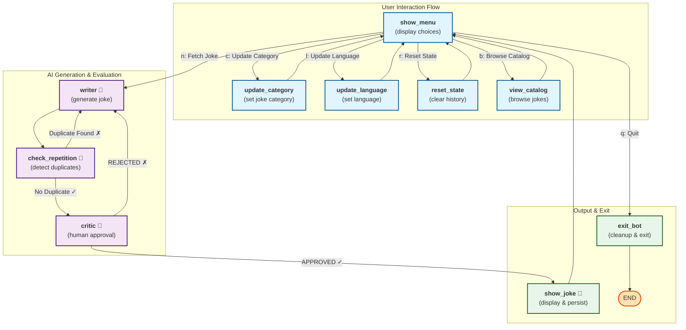

# Joke Bot

A joke-telling chatbot built with LangGraph demonstrating stateful graph-based workflows. This project includes two implementations: a simple rule-based bot and an advanced bot using AI (writer + critic) for joke generation and evaluation.

## Project Structure

- **`joke_bot_simple.py`** – Simple rule-based joke bot using PyJokes library
- **`joke_bot_with_writer_critic.py`** – Advanced AI-driven bot with LLM writer and critic nodes

## Installation

1. Clone the repository:
   ```bash
   git clone <repository-url>
   cd joke-bot
   ```

2. Create a virtual environment and activate it:
   ```bash
   python -m venv venv
   source venv/bin/activate  # On Windows: venv\Scripts\activate
   ```

3. Install dependencies:
   ```bash
   pip install -r requirements.txt
   ```

## Usage

### Simple Joke Bot

Run the simple rule-based joke bot:
```bash
python src/joke_bot_simple.py
```

Features:
- Fetch random jokes from different categories (neutral, chuck, all)
- Interactive menu to get next joke, change category, or quit
- No LLM dependencies - uses PyJokes library for joke generation

Follow the on-screen prompts:
- `n`: Get the next joke
- `c`: Change joke category
- `q`: Quit the application

### JokeBot with Writer & Critic

Run the advanced AI-driven joke bot:
```bash
python src/joke_bot_with_writer_critic.py
```

This implementation features an agentic workflow with specialized LLM nodes, duplicate detection, and joke persistence:

- **Writer Node** – Generates creative jokes based on selected category and language
- **Repetition Check Node** – Detects duplicate jokes against history
- **Critic Node** – Replaced with human approval (user approves/rejects jokes)
- **Joke Catalog** – Persists all approved jokes to a JSON file
- **Interactive Menu** – Users can fetch jokes, update category/language, browse catalog, reset state, or exit

#### Workflow Diagram



**Key Features:**
- State-driven workflow using LangGraph
- Conditional routing based on user choice, repetition check, and human approval
- **Duplicate detection** – Prevents telling the same joke twice
- **Joke Catalog** – Automatically persists all approved jokes to `src/data/joke_catalog.json`
- **Browse Catalog** – Users can view catalog statistics and filter jokes by category
- Persistent state across multiple joke generations
- Configurable LLM models via `config.yaml`

**Joke Catalog Details:**
- All approved jokes are automatically saved to `src/data/joke_catalog.json` in JSON format
- Duplicates within the catalog are automatically detected and prevented
- Users can browse the catalog and filter jokes by category (neutral, chuck, all)
- Catalog statistics show total joke count and breakdown by category
- The catalog persists across sessions, allowing users to build a collection of their favorite jokes

**Menu Options:**
- `n` – Fetch next joke (generates, checks for duplicates, and gets human approval)
- `c` – Change joke category
- `l` – Change language
- `b` – Browse and view saved jokes from the catalog
- `r` – Reset state (clears session jokes but preserves catalog)
- `q` – Exit the application

**Human Approval Workflow:**
- After a joke is generated and passes the repetition check, the user approves or rejects it
- Approved jokes are immediately saved to the catalog
- Rejected jokes trigger the writer to generate a new one
- Up to 5 retry attempts before forcing approval

## Requirements

- Python 3.12+
- Dependencies listed in `requirements.txt`

## License

[Add license information here]
